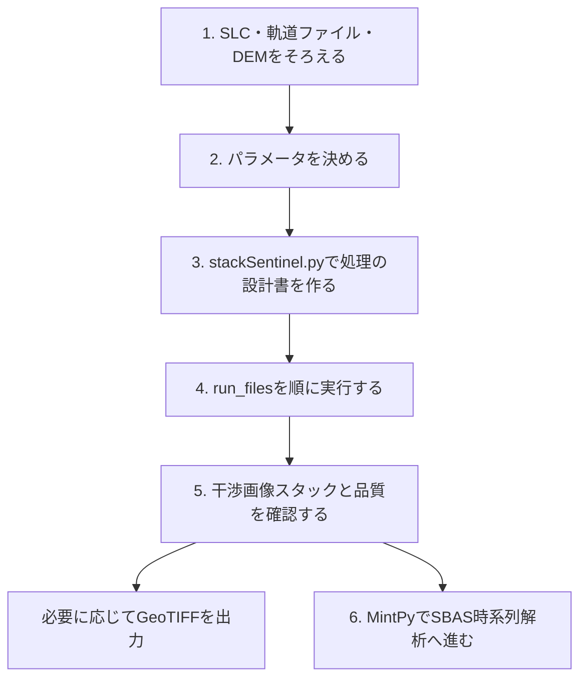

# ISCE2で干渉画像スタックを作る作業の流れ

このページでは、Sentinel-1 IW SLCを使う解析を、**作業する人が何を用意し、何を実行し、何を次へ渡すか**の順に説明します。
使用するのはISCE2の `stackSentinel.py`、処理モードは `interferogram` です。
実行コマンドは [操作マニュアル](操作マニュアル.md)、各設定の意味は [処理パラメータ](処理パラメータ.md) を参照してください。



ISCE2で複数ペアの干渉画像を作り、それをMintPyで時系列解析する、という役割分担です。
このツールが実行するのはISCE2側の準備・処理とGeoTIFF出力までです。MintPyの導入・設定・実行は別途行います。

## 1. まず解析に必要なデータをそろえる

最初に、観測したい地域と期間を決め、次の3種類を用意します。

| データ | なぜ必要か | 本ツールでの取得 |
|---|---|---|
| SLC | 衛星が観測した振幅・位相を持つ画像。異なる日の位相を比較する材料になる | `download` |
| 軌道ファイル | 観測時の衛星の位置・速度。画像の位置合わせや観測幾何の計算に使う | `orbit` |
| DEM | 地形の高さ。地形と観測幾何の効果を計算し、干渉位相を補正するために使う | `dem` |

SLCは同じ相対軌道・観測方向で、対象を共通してカバーするIWサブスワス・バーストと偏波を持つ観測を選びます。
通常の画像を見るだけのGRDではなく、位相情報を持つ **IW SLC** を使います。
軌道ファイルは対象衛星と観測時刻に対応するもの、DEMは処理範囲を含み、ISCE2で使うWGS84楕円体高のものが必要です。

本ツールでは、先に作業ディレクトリと設定YAMLを用意し、`init` で保存先を作成します。
その後、ASFから保存したJSON／GeoJSONを指定してSLCをダウンロードし、軌道ファイル、DEMの順にそろえます。
ASFのJSONは取得対象の一覧で、SLC画像そのものではありません。

```text
作業ディレクトリ/
├── config/        設定YAML・ASF検索結果JSON
└── input/
    ├── slc/       SLC
    ├── orbit/     軌道ファイル
    ├── dem/       DEM
    └── aux/       必要な場合の補助ファイル
```

**この段階で確認すること：** 対象のSLCが全件そろい、対応する軌道とDEMがあり、設定YAMLからその保存先を参照できること。
本ツールの `dem` はSRTMを使い、SLCの画像範囲から必要な取得範囲を求めます。完了時に表示されるDEMのパスを `paths.dem` に設定します。

## 2. 処理のパラメータを決める

入力がそろったら、「どの範囲を、どの条件で、どの観測の組み合わせについて処理するか」を決めます。

例えば、対象範囲、使うIWサブスワス、位置合わせの基準日、干渉ペアの接続数、マルチルック数、アンラップの有無です。
本ツールでは、これらをプロジェクトのYAMLに記入します。

各パラメータの意味・初期値・決め方は **[処理パラメータ](処理パラメータ.md)** にまとめています。
基準日は位置合わせ先となる日、干渉ペアは位相を比較する2日の組み合わせであり、別々に指定します。

## 3. `stackSentinel.py` で処理の設計書を作る

通常のISCE2では、入力データの場所とパラメータを `stackSentinel.py` の引数に指定します。
本ツールでは **`prepare`** がYAMLを読み、対応する引数を組み立てて `stackSentinel.py` を呼び出します。

ここでいう「設計書」は、以下の2つを指します。

| 生成先 | 書かれている内容 |
|---|---|
| `processing/configs/` | 各処理で使う入力・出力・パラメータなどの詳細設定 |
| `processing/run_files/` | どの設定を使ってどのコマンドを実行するか。工程ごとの実行スクリプト |

**この時点では、位置合わせや干渉画像作成はまだ実行されません。**
まず処理手順を生成し、その後に実行する構成です。[ISCE2の公式説明](https://github.com/isce-framework/isce2/blob/b7702cfbd571681a133ebc5c3b23a10c78d52706/contrib/stack/topsStack/README.md) でも、この2段階を分けています。

```text
processing/
├── configs/
│   └── 工程・観測日・ペアごとの設定ファイル
└── run_files/
    ├── run_01_unpack_topo_reference
    ├── run_02_unpack_secondary_slc
    ├── ...
    └── run_16_unwrap
```

`run_files` はディレクトリ名で、その中に `run_01_…` などのファイルが入ります。
各ファイルは、対応する `configs` の設定を指定して処理を呼び出します。1工程に複数観測・複数ペア分のコマンドが入ることもあります。

**実行前に確認すること：** 対象範囲、基準日、処理する日付とペア、アンラップの有無が意図どおりであること。
YAMLを変更した場合は、その変更を反映するために設計書を再生成する必要があります。

## 4. `run_files` を番号順に実行する

ISCE2を直接使う場合は、生成したスクリプトを番号順に実行します。前の工程の出力を次の工程が使うため、順序が重要です。
本ツールでは **`run`** がこの実行を管理し、ログを残し、エラーがあれば停止します。

標準の **新規スタック・NESD位置合わせ・interferogram・アンラップあり** では、次の16工程になります。
設定によって工程数・番号は変わるため、最終的には生成された `run_files` を確認してください。
名称と順序は [使用しているISCE2の生成処理](https://github.com/isce-framework/isce2/blob/b7702cfbd571681a133ebc5c3b23a10c78d52706/contrib/stack/topsStack/stackSentinel.py#L633) に対応します。

| 工程 | スクリプト名（`run_` に続く部分） | 主な役割 |
|---|---|---|
| 01 | `01_unpack_topo_reference` | 基準日のSLC読込と地形・観測幾何の計算 |
| 02 | `02_unpack_secondary_slc` | 他の観測日のSLC読込 |
| 03 | `03_average_baseline` | 基準日との平均的な軌道間隔を計算 |
| 04 | `04_extract_burst_overlaps` | バースト重複部分を抽出 |
| 05 | `05_overlap_geo2rdr` | 重複部分の幾何的な位置ずれを計算 |
| 06 | `06_overlap_resample` | 重複部分を基準日に合わせて再標本化 |
| 07 | `07_pairs_misreg` | 観測ペア間の残る位置ずれを推定 |
| 08 | `08_timeseries_misreg` | ペアの推定値から各観測日の位置ずれを求める |
| 09 | `09_fullBurst_geo2rdr` | バースト全体の幾何的な位置ずれを計算 |
| 10 | `10_fullBurst_resample` | 補正量を使って全観測を位置合わせ |
| 11 | `11_extract_stack_valid_region` | スタックの有効領域を整理 |
| 12 | `12_merge_reference_secondary_slc` | バーストのSLC・幾何情報を結合 |
| 13 | `13_generate_burst_igram` | 選択ペアのバースト干渉画像を生成 |
| 14 | `14_merge_burst_igram` | 干渉画像の結合・マルチルック |
| 15 | `15_filter_coherence` | 干渉画像のフィルタとコヒーレンス推定 |
| 16 | `16_unwrap` | 位相アンラップ |

大きく分けると、01〜03が読込と幾何情報の準備、04〜11が位置合わせ、12〜16が画像の結合・干渉画像作成・アンラップです。
08の「timeseries」は位置ずれの推定を指します。この段階で地表変位の時系列を求めているわけではありません。

`unwrap: false` の場合、本ツールはアンラップ工程を実行対象から外します。
標準的なMintPyのSBAS処理へ進む場合は、アンラップ結果も必要です。

**実行中に確認すること：** どの工程まで完了したか、エラー時のログはどこか。
ログ・実行記録は作業ディレクトリの `logs/` に保存します。
同じ入力・設定のまま再開する場合は `run --resume` を使います。設定変更後の再生成は [詳細手順](reference.md#位置合わせの設定とnesdエラー) を参照してください。

## 5. 完成した干渉画像スタックを確認する

完走すると、位置合わせ済みの観測から作った、複数ペアの干渉画像がそろいます。
アンラップまで実施した場合は、主に次の結果を確認します。

| 主な保存先 | 内容 |
|---|---|
| `processing/merged/interferograms/` | ペアごとの干渉画像、コヒーレンス、アンラップ位相、連結成分など |
| `processing/merged/geom_reference/` | 緯度・経度・高さ・視線方向などの幾何情報 |
| `processing/reference/` | 基準観測のメタデータなど |
| `processing/baselines/` | 軌道間隔の情報 |

まず、対象ペアがそろっているか、コヒーレンスが低い領域はどこか、アンラップ結果に不自然な飛びや分断がないかを確認します。
正常終了だけで結果の妥当性が決まるわけではありません。

本ツールの **`export`** を使うと、地図上で確認できるGeoTIFFと `preview.png`・`report.html` を作れます。
出力先は `output/geocoded/` です。アンラップ位相も出力するときは `--include-unwrapped` を指定します。

これは結果確認のための出力です。**MintPyへ渡すためにGeoTIFF化が必須というわけではありません。**
後段の解析に必要なISCE2形式のファイルとメタデータを残すため、`processing/` は保存しておきます。
仮想結合ファイルが参照する元ファイルも必要です。

## 6. MintPyでSBAS時系列解析へ進む

ここまでで、SBAS時系列解析の入力に使う干渉画像スタックを準備できます。
SBASは、観測間隔や軌道間隔が比較的小さい観測ペアを組み合わせ、その位相差のネットワークから各観測時点の変位を推定する考え方です。

役割は次のように分かれます。

| 担当 | 作るもの |
|---|---|
| ISCE2／本ツール | 複数ペアの干渉画像・アンラップ位相・コヒーレンス・幾何情報 |
| MintPy | それらを読み込み、設定に応じた品質評価・補正と時系列推定を行い、視線方向の変位時系列や変位速度を求める |

MintPyには、ISCE2形式の結果を読み込む機能と `smallbaselineApp.py` による時系列解析の流れがあります。
詳しくは [MintPy公式説明](https://mintpy.readthedocs.io/en/latest/) を参照してください。

MintPy側では、主に次のファイルの場所を設定します。

- アンラップ位相（例：`filt_fine.unw`）とコヒーレンス（例：`filt_fine.cor`）
- 連結成分（SNAPHUの場合など：`filt_fine.unw.conncomp`）
- 高さ・緯度・経度・視線方向などの幾何情報
- 基準観測のメタデータとベースライン情報

配置と読み込み設定は [MintPyのISCE／topsStack用入力例](https://mintpy.readthedocs.io/en/latest/dir_structure/) に対応させて確認します。
本ツールのGeoTIFFだけを渡せば時系列解析が終わる、という手順ではありません。
**本ツールからMintPyへの接続設定・通し検証はまだ整備していません。** ここでは次に進む解析の位置づけを示しています。

また、`pairs.connections` は観測順の接続数であり、時間・空間ベースラインを閾値で選別する設定ではありません。
MintPyへ進む際は、ペアの品質、ベースライン、ネットワークのつながりを確認します。干渉画像を多数作っただけではSBAS解析の完了にはなりません。

## 本ツールのコマンドとの対応

| 作業 | コマンド |
|---|---|
| 保存場所を用意する | `init` |
| SLC・軌道ファイル・DEMをそろえる | `download` → `orbit` → `dem` |
| YAMLから処理の設計書を作る | `prepare` |
| 生成された工程を順番に実行する | `run` |
| 地図上で確認する結果を出力する | `export` |
| SBAS時系列解析へ進む | 別途MintPyを設定・実行 |

実際に作業を始める際は [操作マニュアル](操作マニュアル.md) に進んでください。
