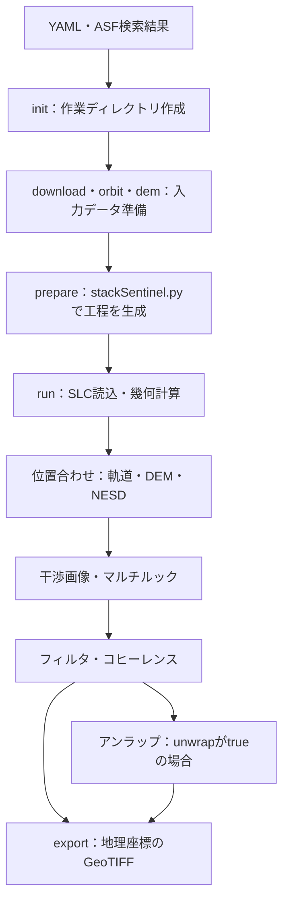

# Sentinel-1 IW SLCから干渉画像を作る処理の解説

このページは、Sentinel-1 IW SLCを使い、ISCE2の `stackSentinel.py` で複数観測の位置合わせ・干渉画像作成を行う流れを説明します。
対象は本ツールの `processing.workflow: interferogram`。実行コマンドを順番に試す場合は [操作マニュアル](操作マニュアル.md) を使ってください。

## 1. 今回は何を作るのか

異なる日に観測した同じ地域のSLCを位置合わせし、選んだ2日ずつの組み合わせについて、位相差を表す干渉画像を作ります。
さらにコヒーレンスを求め、必要に応じてアンラップし、地図上で扱えるGeoTIFFに出力します。

「スタック」は、複数時点の画像を共通の座標にそろえた画像群です。
このツールの処理完了時点で得られるのは、主に**各ペアの位相・コヒーレンス**です。
SBAS等による変位時系列の推定、変位速度の算出、PGV・PGCはこの処理には含みません。

### ISCE2にあるモードと、このツールの対応範囲

| `stackSentinel.py` の `-W` | 主な目的 | 本ツールのYAMLからの指定 |
|---|---|---|
| `slc` | 位置合わせ済みSLCスタックを作る | 未対応 |
| `interferogram` | 干渉画像・コヒーレンス・アンラップ結果を作る | **今回使用するモード** |
| `correlation` | アンラップを行わず、干渉画像・コヒーレンスを作る | 未対応 |
| `offset` | 画像間のオフセットを推定する | 未対応 |

ISCE2全体には他のセンサや処理アプリケーションもあります。この表は `stackSentinel.py` のモードです。
本ツールで `unwrap: false` にしても、指定モードは `interferogram` のままです。生成された工程のうちアンラップを実行対象から外します。
モードと生成処理の定義は [使用バージョンのstackSentinel.py](https://github.com/isce-framework/isce2/blob/b7702cfbd571681a133ebc5c3b23a10c78d52706/contrib/stack/topsStack/stackSentinel.py) を参照してください。

## 2. 入力データの役割

| 入力 | 中身・役割 | このツールでの用意方法 |
|---|---|---|
| ASFのJSON／GeoJSON | ダウンロード対象の一覧。画像本体ではない | 利用者がASFから保存 |
| SLC | 振幅と位相を持つ複素画像 | `download` |
| 軌道ファイル（EOF） | 衛星の位置・速度。観測時刻をカバーするものが必要 | `orbit` |
| DEM | 地形の高さ。観測幾何の計算や地形に由来する位相の補正に使う | `dem` |
| YAML | 作業場所、対象範囲、基準日、ペア、処理条件 | 利用者が設定 |

対象地域が同じだけではペアにできません。同じ相対軌道・観測方向、共通するIWサブスワスとバースト、同じ偏波など、観測条件を確認します。
GRDではなく **IW SLC** を用意してください。入力例のVVは、全観測にVVが含まれる場合に使います。

本ツールのDEM取得はSRTMを使用し、ISCE2に渡す高さをWGS84楕円体高にそろえます。
取得範囲はSLCの画像範囲から求めるため、処理用の小さな `bbox` より広くなる場合があります。
生成後、表示されたDEMの相対パスを `paths.dem` に設定します。
`input/aux` は補助ファイル用で、すべての観測で追加ファイルが必要になるわけではありません。
実装は [DEM処理](../src/sentinel_1_stack/dem.py) と [処理前の入力検査](../src/sentinel_1_stack/prepare.py) を参照してください。

## 3. ツールとISCE2の関係



| コマンド | 行うこと | 確認するもの |
|---|---|---|
| `init` | YAMLの作業場所をもとにディレクトリを作成 | 作業ルートと保存先 |
| `download` | 指定JSONからSLCを取得 | 製品一覧、全件の取得完了 |
| `orbit` | 各SLCをカバーする軌道を取得 | 衛星・有効期間、POEORB／RESORB |
| `dem` | 画像範囲のDEMを取得・結合・高さ変換 | 完成DEMのパス、欠損の有無 |
| `prepare` | 入力を検査し、ISCE2の設定と実行スクリプトを生成 | 基準日、ペア、範囲、工程一覧 |
| `run` | 生成済み工程を順に実行し、失敗時に停止 | 工程別ログと実行状態 |
| `export` | 処理結果を共通の地理座標グリッドに出力 | GeoTIFF、確認画像、品質記録 |

**`prepare` では解析本体はまだ動きません。** `stackSentinel.py` は `configs/` と `run_files/` を生成し、その後 `run` が実処理を進めます。
この分離は [ISCE2のTOPSスタック説明](https://github.com/isce-framework/isce2/blob/b7702cfbd571681a133ebc5c3b23a10c78d52706/contrib/stack/topsStack/README.md) に沿っています。

ホストの `work_dir` はコンテナ内では `/work` に見えます。例えば `/work/input/slc` は、ホストの作業ディレクトリの `input/slc` と同じ保存先です。

```text
作業ディレクトリ/
├── config/       設定YAML・ASFのJSON
├── input/
│   ├── slc/      SLC
│   ├── orbit/    軌道ファイル
│   ├── dem/      DEM
│   └── aux/      補助ファイル
├── processing/
│   ├── configs/      ISCE2の工程別設定
│   ├── run_files/    工程別実行スクリプト
│   └── merged/       結合されたSLC・幾何情報・干渉画像など
├── output/geocoded/  GeoTIFF・確認画像・品質記録
└── logs/             ツールの実行ログ・実行記録
```

`processing/` の中間結果を削除すると、再開や再出力に使えなくなることがあります。
特に `virtual_merge: true` の仮想結合ファイルは、参照先の実ファイルが必要です。

## 4. 基準日と干渉ペアは別の設定

`processing.reference_date` は、**全SLCの位置合わせ先となる観測日**です。
すべての干渉画像をこの日とのペアにする、という指定ではありません。また、変位を0と置く地上の基準点でもありません。

`pairs.connections` は、日付順で各観測を後続の何観測と組み合わせるかを指定します。
A・B・C・Dの4観測なら、次のようになります。

| 設定 | 生成する干渉ペア |
|---|---|
| `connections: 1` | A–B、B–C、C–D |
| `connections: 2` | A–B、A–C、B–C、B–D、C–D |

6観測なら、それぞれ5ペア・9ペアです。「2」は2日後という意味ではなく、後続2観測です。
ペアを増やすと比較材料が増える一方、計算量・保存容量も増えます。長い観測間隔のペアではコヒーレンスが下がる場合があります。
ペア生成の実装は [prepare.py](../src/sentinel_1_stack/prepare.py) を参照してください。

基準日は、入力に存在し、対象範囲を十分カバーする観測から選びます。
期間中央付近を候補にしつつ、欠損バースト・観測幾何・データ品質も確認します。中央の日が常に最良という意味ではありません。

## 5. `run` の内部で行う16工程

以下は、固定しているISCE2で **新規スタック・NESD・interferogram・アンラップあり** の場合です。
他の位置合わせ方式では工程数・番号が変わるため、実際の `processing/run_files/` を確認してください。
工程名と順序は [stackSentinel.pyの生成処理](https://github.com/isce-framework/isce2/blob/b7702cfbd571681a133ebc5c3b23a10c78d52706/contrib/stack/topsStack/stackSentinel.py#L633) に対応します。

| 工程 | スクリプト名（`run_` に続く部分） | 主な役割 |
|---|---|---|
| 01 | `01_unpack_topo_reference` | 基準日のSLC読込と地形・観測幾何の計算 |
| 02 | `02_unpack_secondary_slc` | 他の観測日のSLC読込 |
| 03 | `03_average_baseline` | 基準日との平均的な軌道間隔を計算 |
| 04 | `04_extract_burst_overlaps` | バースト重複部分を抽出 |
| 05 | `05_overlap_geo2rdr` | 重複部分の幾何的な位置ずれを計算 |
| 06 | `06_overlap_resample` | 重複部分を基準日に合わせて再標本化 |
| 07 | `07_pairs_misreg` | 観測ペア間の残る位置ずれを推定 |
| 08 | `08_timeseries_misreg` | ペアの推定値から各観測日の位置ずれを求める |
| 09 | `09_fullBurst_geo2rdr` | バースト全体の幾何的な位置ずれを計算 |
| 10 | `10_fullBurst_resample` | 補正量を使って全観測を位置合わせ |
| 11 | `11_extract_stack_valid_region` | スタックの有効領域を整理 |
| 12 | `12_merge_reference_secondary_slc` | バーストのSLC・幾何情報を結合 |
| 13 | `13_generate_burst_igram` | 選択ペアのバースト干渉画像を生成 |
| 14 | `14_merge_burst_igram` | 干渉画像の結合・マルチルック |
| 15 | `15_filter_coherence` | 干渉画像のフィルタとコヒーレンス推定 |
| 16 | `16_unwrap` | 位相アンラップ |

### 位置合わせとNESD

IWのTOPS観測は複数のバーストから構成されます。単に画像の輪郭を重ねるのではなく、対応する散乱体を同じ画素にそろえる処理が必要です。
軌道とDEMで計算した幾何的な対応に、NESDで推定する位置ずれの補正を加えます。
`08_timeseries_misreg` の「timeseries」は位置ずれの推定を指し、地表変位の時系列解析ではありません。

`processing.num_overlap_connections` はNESD推定用の接続数です。最終干渉ペアの `pairs.connections` とは別です。
`geometry` を選ぶとNESDの補正を使いません。NESDエラー時に自動で切り替える実装にはしていません。

### 干渉画像・マルチルック・フィルタ

位置合わせした複素SLCの一方と、もう一方の複素共役の積から位相差を求めます。
処理では観測幾何・地形の効果を補正しますが、残った位相をすべて地表変位と解釈することはできません。

マルチルックは複数画素をまとめる処理です。`range_looks` がレンジ方向、`azimuth_looks` が衛星の進行方向です。
ルック数を大きくすると細部が平均化されます。`filter_strength` はさらに位相の空間的な平滑化に関わります。
PGV・PGCなど局所的な位相変化を後で調べる場合は、ルック数・フィルタ条件を記録し、未フィルタ出力とも比較してください。

### コヒーレンス・アンラップ・海域

コヒーレンスは、局所的な位相の整合性を表す0〜1の指標です。高い値でも変位の正しさを保証しません。
アンラップは、位相の2π周期の折り返しをつなぎ直す処理です。誤った整数周期が割り当てられることもあります。
海域などで低コヒーレンスの領域を挟むと、陸域が別々の連結成分になることがあります。
島内で位相をつなげられても、離れた島や陸地との位相オフセットが決まるとは限りません。
位相・コヒーレンス・アンラップの基礎は [ASFのInSAR解説](https://hyp3-docs.asf.alaska.edu/guides/insar_product_guide/) を参照してください。
この資料のHyP3固有の出力仕様は、本ツールの仕様とは異なります。

## 6. 主要パラメータの決め方

以下の数値は [設定例](../config/example.yaml) の初期値です。地域ごとの最適値ではありません。

| 設定 | 初期値 | 判断すること |
|---|---|---|
| `swaths` | 未設定 | 対象範囲を含み、各観測に共通するIWサブスワス |
| `bbox` | 未設定 | `[南端, 北端, 西端, 東端]`。対象と周辺の解析に必要な陸域を含める |
| `reference_date` | 未設定 | 共通座標の基準となる観測日。文字列 `"YYYYMMDD"` |
| `coregistration` | `NESD` | 位置合わせ方式。変更は処理全体に影響 |
| `esd_coherence_threshold` | `0.85` | ESD推定に採用する画素の閾値 |
| `snr_misreg_threshold` | `10.0` | レンジ方向の位置ずれ推定のSNR閾値 |
| `num_overlap_connections` | `3` | NESDの推定ネットワークの接続数 |
| `range_looks` / `azimuth_looks` | `9` / `3` | 細部の保持と平均化のバランス |
| `filter_strength` | `0.5` | フィルタの強さ。結果の平滑化を確認 |
| `pairs.connections` | `1` | 最終干渉ペアの接続数 |
| `unwrap` / `unwrap_method` | `true` / `snaphu` | アンラップの実施と方法 |
| `execution.num_processes` | `1` | 工程内の並列数。メモリ使用量も増える |
| `export.pixel_size_degrees` | `0.0001` | 出力地図グリッドの間隔。元の分解能とは別 |

**ESDの閾値0.85は、最終GeoTIFFを0.85でマスクする設定ではありません。**
出力コヒーレンスに対する解析用のマスクは、後段で目的に合わせて決めます。
有効画素不足なら、まずESDのログ・有効画素数・対象範囲を確認します。閾値を下げれば必ず精度が改善するわけではありません。

`9×3` は9m×3mという意味ではありません。またGeoTIFFの画素間隔を細かくしても、マルチルックで失われた細部は復元しません。
狭い火山島では「小さいbbox」「高いESD閾値」「海域が多い」という条件を一緒に確認してください。

## 7. `export` で何が得られるか

ISCE2の今回のスタック処理と、地理座標への出力は別工程です。本ツールでは `export` が緯度・経度の幾何情報を使い、EPSG:4326の共通グリッドに変換します。

| ファイル | 意味 |
|---|---|
| `phase_raw.tif` | フィルタ前のラップ位相。元のSLCそのものではなく、結合・マルチルック後の干渉位相 |
| `phase_final.tif` | フィルタ後のラップ位相（rad） |
| `coherence.tif` | コヒーレンス |
| `phase_unwrapped.tif` | アンラップ位相（rad）。`--include-unwrapped` 指定時 |
| `connected_components.tif` | アンラップの連結成分。同上。番号はペアごとに独立 |
| `preview.png` / `report.html` | 結果確認用の画像・一覧 |
| `quality.json` | 有効画素・コヒーレンス等の品質記録 |

ラップ位相は±π境界をまたぐため、角度をそのまま平均せず、複素位相の成分を補間してから角度に戻します。
アンラップ位相と連結成分は、別成分を混ぜないよう最近傍で出力します。
実装は [export.py](../src/sentinel_1_stack/export.py) と [unwrapped_export.py](../src/sentinel_1_stack/unwrapped_export.py) を参照してください。

アンラップ位相のGeoTIFFも、まだ変位量の地図ではありません。
LOS変位として解釈するには、位相の符号、波長、空間基準、連結成分、大気・軌道・DEM残差等を確認する必要があります。
LOSは衛星視線方向なので、単一方向の観測だけで鉛直変位や火山の膨張・収縮が直接決まるわけではありません。
これらの限界は [ASFのLOS・誤差の説明](https://hyp3-docs.asf.alaska.edu/guides/insar_product_guide/#limitations) も参照してください。

## 8. 失敗したとき・設定を変えたいとき

| 状況 | 最初に確認すること |
|---|---|
| 入力不足で `prepare` が停止 | SLC、対応軌道、DEMと付随ファイル、YAMLの指定 |
| NESDで有効画素不足 | ESDログ、重複部分のコヒーレンス、閾値と範囲 |
| `run` が終了コード-9で停止 | OSやDockerの記録、メモリ使用量。強制終了であり、表示だけでOOMとは断定しない |
| アンラップが重い | `--unwrap-jobs 1` とメモリ。並列数を増やす前に1ペアで確認 |
| 処理は完了したが品質が悪い | 位相・コヒーレンス・連結成分、位置合わせの記録 |

入力・設定・生成済みスクリプトが同じなら、`run --resume` で完了済み工程を省いて再開します。
設定を変えた場合は、単純な再開ではなく既存処理を退避し、`prepare` から再生成する手順を使います。
具体的な操作は [再開・設定変更の説明](reference.md#位置合わせの設定とnesdエラー) を参照してください。
**終了コード0は処理が完走したという意味です。解析結果の妥当性は、出力を確認して判断します。**
